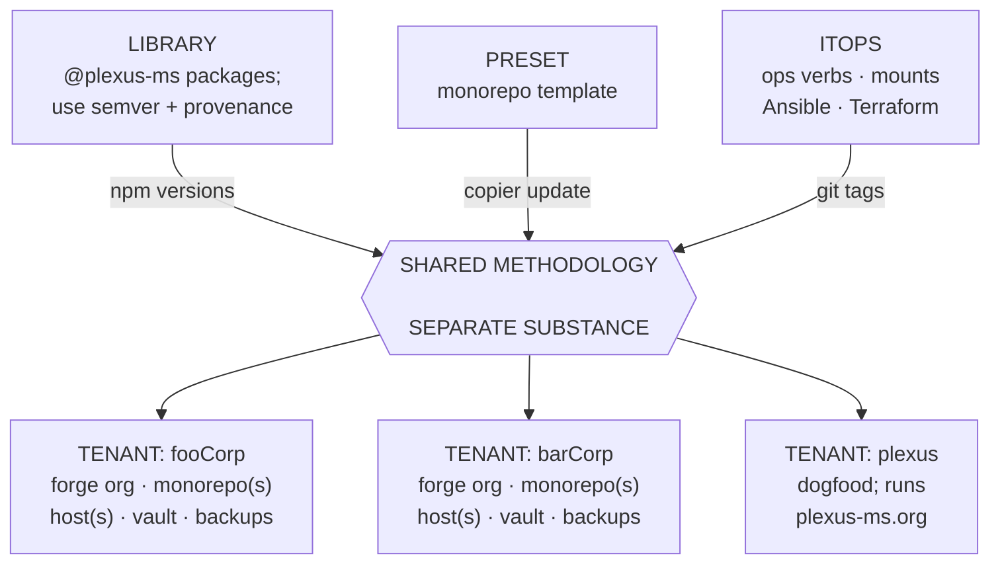
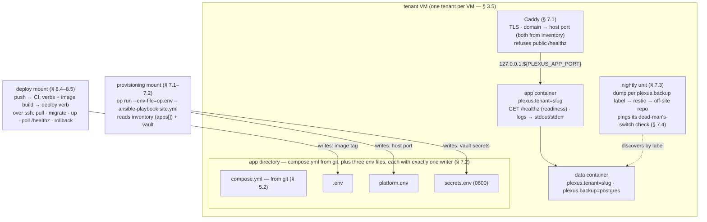

Plexus is a comprehensive, opinionated, federated IT initiative: 
A neutral collection of guidelines, tools, and approaches, spanning software development to operations. 

This document, referred to as the Plexus Standard, PLX, or simply "the standard", is the contract a consumer of Plexus must implement.

The standard's version is named `v0` while a draft, then `vMAJOR.MINOR`.
Minor revisions are additive or clarifying; only a major revision changes or removes requirements. 
`v0` promises none of that yet: any revision can change anything.

*Cite requirements by section mark and document short name (e.g. "§ 4.1 PLX").
Sections nest at most three levels deep and new sections append at the end of their level, so numbers stay stable within a major version.*


## § 1 General provisions

### § 1.1 Normative language

> - The keywords MUST, MUST NOT, SHOULD, SHOULD NOT, and MAY in this document are to be interpreted as described in BCP 14 ([RFC 2119](https://www.rfc-editor.org/rfc/rfc2119), [RFC 8174](https://www.rfc-editor.org/rfc/rfc8174)).
> - Blockquotes in this document are reserved for normative statements; everything outside a blockquote is informative prose.
> - Normative keywords appear only inside blockquotes; a keyword outside one is a defect in this document, and should be reported as a bug.

Each section opens with its requirements as a quoted list like the one above;
the prose below a requirements block explains and motivates, but never binds.
A section without a requirements block is entirely informative.

### § 1.2 Normative tools and services

> - A tool or service named inside a MUST is mandated: part of the standard itself.
> - A tool or service named inside a SHOULD is a suggested default; a tenant MAY substitute an equivalent, owning the deviation in `PLEXUS.md` (§ 3.4).

Mandated tools are the standard's own mechanics: mise and hk across all stacks (§ 4), pnpm and the § 4.2 toolchain within JS/TS repos.
Suggested tools are the substitutable outer ring — chiefly the external services Plexus deliberately consumes rather than self-hosts (GitHub as forge, 1Password as vault) and swappable platform components (Caddy, Renovate).
The design intent behind the split is lock-in resistance: proprietary services sit behind thin adapters over Plexus's own portable primitives — GitHub Actions workflow wrappers are dumb mounts over hand-runnable script verbs, `op.env` is plain dotenv pointers any vault CLI could resolve, so leaving a suggested service means adjusting an adapter layer, not rewriting logic.

### § 1.3 Terminology

The standard's vocabulary, defined once:

- **Tenant** (§ 3) — one trust domain in the federation: its own forge org, monorepo, VM(s), secrets vault, backups.
  Nominally a distinct legal person or organization, but the boundary that matters is *access*, not legal personality — `plexus` itself is a tenant without being a distinct legal person.
- **Primitive** — any named guideline, tool, or approach the initiative ships or prescribes: a verb, a mount, an Ansible role, a published package, the copier template, a label scheme, a file layout, an endpoint path.
  Decided once, reused, versioned and published, or otherwise propagated (§ 9).
- **Verb** — a stateless, hand-runnable procedure that does one operational thing (deploy, backup, migrate, …), authored in a portable manner.
  One name, two shapes: 
  - **ops verbs** are the shared bash scripts `itops` ships (`scripts/deploy.sh` — § 8.4), tenant-neutral and versioned by the `itops` tag; 
  - **contract verbs** are the per-app mise tasks the app contract requires (`mise :migrate` — § 5.1), each encoding that app's own incantation behind the standard name.
- **Mount** — the thin, disposable glue binding a verb or role to an event or state source it doesn't own: a workflow wrapper on forge events (§ 8.5), a tenant playbook on an inventory (§ 7), a systemd timer on the clock (§ 7.4).
  Mounts carry no logic.
- **Methodology** and **substance** — the federation's sharing axis (§ 3.1): *methodology* is knowledge and code-shaped-as-knowledge, shared across all tenants; *substance* is data, secrets, access, hosts, and is never shared.
- **Seam** — where the dev side and the ops side meet, made explicit as the app contract (§ 5).

### § 1.4 Scope

This standard binds **tenants implementing Plexus**.
Applicability is divided as follows for each section: 
- § 2 states what a tenant can rely on from upstream (so technically, this section is the only one to bind not the tenant, but the Plexus maintainers),
- §§ 3-4 bind the tenants in terms of structure and tooling,
- §§ 5-6 bind the tenant's apps at the seam of dev and ops,
- § 7 binds a tenant's operations platform,
- § 8 binds the tenant's CI/CD flows, like plays being acted out on the stage the operations platform has set, and
- § 9 binds the tenant's propagation of upstream changes to all of the previous sections.


## § 2 The supply chain and upstream guarantees

Whoever controls `plexus-ms` ships code and knowledge-shaped-as-code that reaches deep into every tenant's hosts, inside every tenant's CI, and inside every tenant's apps.
**Adopting the standard means trusting its maintainers.**
The mitigations are structural, and stated here as guarantees the tenant can rely on:

> - The `plexus-ms` repos are **public and GPLv3-licensed**; every change is reviewable, and nothing breaks on the day the upstream goes unmaintained — published versions keep resolving, and the repos remain forkable.
> - `@plexus-ms/*` packages are published to the public NPM registry; published versions are immutable and carry provenance attestations linking each version to its source commit and build.
> - A breaking change to a package is released as a semver major, with a migration note in the changelog.
> - Tenant substance — business logic, secrets, anything tenant-specific — never appears in a public package.

These guarantees are obligations of the `plexus-ms` maintainers; the mechanics that honor them are documented in the [Manual](manual.md).
They are stated in this document because the tenant's risk decision on how unattended to let updates flow (§ 9.1) rests on them.

One sharp edge is named rather than implied away: some pins reference Git tags, which are movable — unlike npm versions, a retargeted tag silently changes what a tenant executes, with no attestation.
Referencing by commit SHA is the immutable alternative; for now the trade-off of readability and update-bot flow over immutability is accepted as a deliberate decision, and § 9.1 stratifies how much of the update flow runs unattended accordingly.



*Figure 1 — the federation at a glance: one tenant-neutral upstream, versioned methodology flowing hub-and-spoke to every tenant, substance staying inside each tenant's own trust domain. Each tenant monorepo(s) hold both sides — dev meets ops at the app contract (§ 5).*


## § 3 The tenant

### § 3.1 Trust domain

> - All tenants MUST share the methodology: the app contract, the `@plexus-ms/*` packages, the reusable CI workflow, the deploy verb, the copier template, the Ansible roles, the doctrine.
> - Tenants MUST NOT share substance: hosts and root access, forge org and repo access, secrets vaults, databases, backups, domains.

What spans the tenants is separate trust domains sharing a *methodology*, not a *runtime* — federation under a common standard, not multi-tenancy.
Nothing federates at runtime: tenants never talk to each other — no shared identity, no inter-instance protocol; what travels is versioned methodology from one upstream, hub-and-spoke (§ 2).
Methodology is knowledge and code-shaped-as-knowledge; no tenant owns it.
Substance stays partitioned because the tenant is the trust boundary.

### § 3.2 Slug & labels

> - Every tenant MUST have a short slug (e.g. `acme`, `initech`, `plexus`).
> - Every deployed service MUST carry the label `plexus.tenant=<slug>`.
> - The slug SHOULD additionally appear consistently in the tenant's forge org name, VM hostnames, Ansible inventory groups, and vault name.

One greppable name threads through every layer.
The label makes the boundary visible exactly where it otherwise blurs: staring at a host wondering whose service this is.

### § 3.3 The `PLEXUS.md` marker

> - Every conforming repo MUST carry a `PLEXUS.md`; in a tenant monorepo, each app additionally carries one at its app root.
> - The marker MUST carry YAML frontmatter with `plx` (the PLX version targeted) and `profile` (`stateless-app`, `stateful-app`, or `tenant-monorepo`).
> - A repo whose `PLEXUS.md` is missing or unparsable is non-conformant.

The name is deliberately distinct from this document: `standard.md` (short name PLX) is the standard, `PLEXUS.md` is the per-repo marker.
Because staleness detection parses it mechanically, the format is specified:

```markdown
---
plx: v1.0             # PLX version this repo targets — REQUIRED
profile: stateful-app # stateless-app | stateful-app | tenant-monorepo — REQUIRED
---

Free-form prose. Owned deviations live here —
one bullet each, with rationale.
```

Machine checks read only the YAML frontmatter; the body is for humans.
`plx` is compared against the current standard version to flag drift; `profile` selects the § 6 profile for an app, or marks the tenant monorepo itself.
The marker is the one artifact the standard cannot degrade gracefully without, because it is how staleness stays visible.

### § 3.4 Conformance & owned deviations

> - A repo conforms to a PLX version when it satisfies every MUST and MUST NOT applicable to it under that version.
> - Deviating from a SHOULD or SHOULD NOT is permitted, but the deviation MUST be recorded in the repo's `PLEXUS.md` with a sentence of rationale.

Which requirements are applicable to a given repo is a scope question, answered by the structure itself (§ 1.4).
Substituting an equivalent for a suggested tool (§ 1.2) is one such deviation.
A recorded deviation reads as a decision; an unrecorded one reads as drift — the marker (§ 3.3) is where the difference is made visible.

### § 3.5 Shared metal

> - Tenants sharing physical hardware MUST be separated by hypervisor virtualization; two tenants never co-mingle inside one VM.
> - Platform concerns — ingress, secrets, backups, monitoring — SHOULD be kept per-tenant as well.
> - Distinct legal persons sharing platform root access MUST document the arrangement in writing — e.g. a one-page document defining the relationship, plus a data-processing agreement where applicable.

At small scale, pooling workloads on one physical host is the correct economics, and virtualization draws the boundary.
Be clear about what it does and does not buy: it solves performance and fault isolation, but it *centralizes* access rather than partitioning it — a hypervisor has unrestricted control over every VM, so the host is a critical attack vector — and it does nothing for legal controllership; hence the written arrangement.
Sharing ingress, networking, or secrets across tenants is a red flag: if the economics seem to force it, file an issue against the standard rather than normalizing the exception.

### § 3.6 Forge org & monorepo layout

> - Tenant repos SHOULD be partitioned by separate forge orgs.
> - A tenant SHOULD use the monorepo pattern: one `<org>/<tenant>` repo holding both the dev side (`apps/`, `packages/`) and the ops side (`infra/`: inventory, host definitions, deployment configs).
> - Tenant monorepos SHOULD be generated from `plexus-ms/preset`.

Org membership governs code access; a person in tenant A's org is simply not in tenant B's.
The monorepo's benefits are direct: apps and the platform that runs them version together, cross-cutting changes land as one atomic commit, and it is safe because a monorepo is one access boundary (§ 9.2).
With several apps in one repo, deploys are per-app and promotion is repo-wide (the release train — § 8.2); a product that persistently needs its own release cadence is the one reason to give it its own repo within the tenant's org (§ 8.2).


## § 4 The toolchain

### § 4.1 mise & hk, in every repo

> - Every tenant repo MUST pin its tools in `mise.toml` and expose its verbs as mise tasks.
> - Every tenant repo MUST wire its checks through hk git hooks: format and lint on pre-commit, typecheck-equivalent and test on pre-push, with stack-appropriate checks behind the same hook names.
> - Git hooks SHOULD delegate to mise tasks.

Plexus mandates the language-neutral [mise-en-place](https://mise.jdx.dev/) for toolchain management and [hk](https://hk.jdx.dev/) for git-hook wiring.
The source of truth is `mise.toml`, holding tool and task definitions; hk configuration (`hk.pkl`) is a plumbing layer on top, which is why hooks delegate — two encodings of one check is drift.
Hooks self-install: a `mise.toml` `[hooks] postinstall = "hk install --mise"` wires them on the first `mise install`, with no per-repo or per-machine step; `HK=0 git …` bypasses a hook when needed.

The answer to *"how do I run you?"* is always a mise verb.
The monorepo path syntax: `mise :verb` addresses the current root, `mise //apps/<app>:verb` a specific project from anywhere, `mise //...:verb` fans out over all of them; bare `mise <verb>` applies only against a standalone `mise.toml`, as on a deploy host.

The standard verbs (§ 5.1) are the stack-neutral layer every app answers; only § 4.2's pnpm/tsc specifics bind JS/TS repos alone.
A Python or Go app takes the same contract with different incantations behind the same verbs — JS/TS is simply the first toolchain the standard has specified.

### § 4.2 The JS/TS toolchain

> - Every Plexus JS/TS repo MUST use the toolchain of this section.
> - JS/TS tenant repos MUST use the monorepo pattern: pnpm workspace plus mise monorepo.
> - Tool versions (node, pnpm, biome, …) MUST be pinned in `mise.toml` and nowhere else; a `package.json` MUST NOT carry `packageManager` or `engines`.
> - The pnpm package manager MUST be used.
> - A monorepo root MUST NOT carry a `package.json`, except where a tool leaves no alternative.

Two pins for one fact is drift — hence mise as the single toolchain authority.
`pnpm-workspace.yaml` (`packages:` globs plus a `catalog:` pinning shared dev-tool versions) owns install and linking; `monorepo_root = true` with `[monorepo] config_roots` in the root `mise.toml` gives two-altitude verbs — `mise //...:test` at the root fans out, `mise :test` inside a package runs only that one.
pnpm defines the workspace without a root manifest; the known tool that forces one is changesets, which tenants do not use (§ 8.1) — the exception lives in `plexus-ms/library` and is the [Manual](manual.md)'s business.
Formatting and linting is Biome; the pre-commit hook runs it on staged files, pre-push runs typecheck and test, per the § 4.1 hook discipline.


## § 5 The app contract

> - Every app MUST satisfy this section, and MUST declare exactly one § 6 profile in its `PLEXUS.md` (§ 3.3).

The contract is the seam made explicit: the set of questions the platform (ops) asks of an app (dev).
It is small, verb-shaped, and identical for every stack — a PayloadCMS + MongoDB app, a Prisma + Postgres app, and a non-JS Django + Postgres app all satisfy it identically.
This section is the profile-neutral base: what CI and the deploy verb rely on for *every* app.
A profile (§ 6) extends it for the app's actual shape.

What the contract deliberately does **not** mention: databases, ORMs, frameworks, or anything interior.
The deploy verb only needs *"is there a migration step and how do I invoke it"* — `mise migrate` (bare form: on the deploy host, the verb runs against the app's standalone `mise.toml`, where path syntax does not apply — § 4.1).
The backup job only needs *"which services hold state and of what type"* — the § 6.2 labels.

### § 5.1 Standard verbs

> - Every app MUST define the standard verbs as mise tasks: `dev`, `migrate`, `test`, and the CI-facing `lint`, `typecheck`, `build`.
> - A verb a given stack has no use for MUST still exist as a documented no-op, never as a missing verb.
> - `migrate` MUST be safe to invoke at any time; its full semantics are defined by the app's profile (§ 6).

The shared pipeline (§ 8.5) and the deploy verb (§ 8.4) invoke an app only through these standard names, so the names are load-bearing and the incantations behind them are not.
"What was the migration command again?" stops being a memory question; the answer is always `mise :migrate`, and the mise task encodes the real incantation.
Toolchain pinning follows § 4 — so setup is `git clone && mise :dev` everywhere.

### § 5.2 compose.yml

> - Every app MUST provide a `compose.yml` declaring the app service and any app-owned infrastructure.
> - Every service in it MUST carry the label `plexus.tenant=<slug>` (§ 3.2).

App-owned infrastructure means services that live and die with the app — a database container is the § 6.2 profile's case.
The platform reads runtime truth from the host (`docker ps`, labels), never from a bookkeeping database, which is why the labels matter.

### § 5.3 The env schema

> - Every app MUST provide an `env.schema` file at the app root declaring every variable the app reads.
> - One variable per line, `KEY=value` dotenv syntax; every variable the app reads MUST be listed.
> - The value position MUST hold the default; an empty value means no default.
> - Flags MUST be a trailing comment on the same line as the key — `# required`, `# secret` — whitespace-separated, combinable in either order.
> - A trailing comment MUST hold flags and nothing else; a trailing comment containing anything outside the flag vocabulary is a schema error — rejected, never skipped. Prose belongs in full-line comments.
> - A value containing a literal `#` MUST be quoted; an unquoted `#` starts a comment.
> - An unflagged key is optional and non-secret; a `secret` key MUST have an empty value position — a default secret in git is a leak, not a default.
> - Parsers MUST ignore full-line comments.
> - Every consumer of the schema MUST parse it through the canonical parser `itops` ships; where this grammar is silent, that parser's behavior is normative.
> - Secret values MUST NOT be committed; they are resolved from the tenant's vault at provisioning time (§ 7.2).

The base format is not invented: it is plain dotenv, the same syntax `docker compose --env-file` and every language's dotenv library already parse; the only Plexus addition is the two-word flag vocabulary.
The result is stack-neutral, greppable (`grep secret env.schema`), and checkable — the platform diffs the schema against the env it provides.
The single canonical parser exists so the micro-format can never fork: an ambiguity is a parser bug to fix once, never a dialect to negotiate.

### § 5.4 One HTTP port

> - The app MUST serve plain HTTP on exactly one container port, published to loopback only.
> - The app MUST NOT hardcode a host port; `compose.yml` publishes via interpolation — `127.0.0.1:${PLEXUS_APP_PORT}:<container-port>`.
> - The app MUST NOT define `PLEXUS_*` keys of its own; the prefix is reserved for platform-injected bindings.

The host side of the binding is not the app's to choose: the host port is assigned by the platform from the tenant's inventory (§ 7.1) and injected at deploy time.
TLS, hostnames, and the domain→port binding are likewise the platform's job; domain and host port alike are deployment substance, so the app stays deployable under any hostname and next to any neighbour.
Platform-injected keys do not appear in `env.schema` — the schema declares what the *app* reads, while `PLEXUS_APP_PORT` is read by compose interpolation; the platform's schema diff ignores `platform.env` keys accordingly.

### § 5.5 Healthcheck

> - The app MUST expose `GET /healthz` with readiness semantics: it MUST return 200 if and only if the process can serve real requests right now.
> - The probe MUST include hard dependencies the app cannot serve without (its own database, with a short bounded timeout) and MUST NOT include soft or third-party dependencies the app survives degraded.
> - The endpoint MUST be cheap, side-effect-free, and unauthenticated.
> - The response SHOULD carry nothing beyond its status code: no version strings, no dependency names, no timings.

The semantics are pinned because the deploy verb's rollback decision rides on this endpoint (§ 8.4), polling it bare over loopback.
Unauthenticated is not the same as private: ingress maps the public domain onto the same single port, so left alone `/healthz` would ride into the open as a free oracle for "is this app's database down" — the platform fences the path at the proxy (§ 7.1), and the empty response is belt and braces.
Plexus deliberately does not split liveness from readiness: that distinction pays for itself only where a reconciler restarts processes on liveness, and the standard has no reconciler — one endpoint, one meaning.
Transient dependency blips are the poller's problem, and handled there (§ 8.4).

### § 5.6 Logs

> - The app MUST write logs to stdout/stderr and MUST NOT manage its own log files.

Shipping and retention are the platform's job.

### § 5.7 CI reference

> - The app's CI MUST run the shared pipeline (§ 8.5): lint → typecheck → test → build → push image.

In practice this is a ~5-line reference to the shared reusable workflow; in a multi-app monorepo the reference is path-scoped per § 8.2.


## § 6 The app contract profiles

A profile is a variant of the app contract: it extends and sharpens § 5 for one recognizable shape of app, the way an interface is taken by a concrete type.
Every app takes exactly one profile and records it in its `PLEXUS.md` (§ 5, § 3.3); the platform treats every app identically through the same verbs and labels, and never needs to know the profile.
Future profiles append here as § 6.3, § 6.4, ….

### § 6.1 The stateless app

For apps holding no state of their own: static and marketing sites, stateless APIs.

> - `compose.yml` MUST declare only stateless services — no data services, and no `plexus.backup` labels.
> - `mise :migrate` MUST exist as a documented no-op.
> - `mise :seed` MAY be omitted.
> - The env schema MAY declare zero secrets.

The deploy verb still calls `mise migrate` uniformly — it never needs to know an app is stateless.
A stateless app degrades gracefully by construction: the host is fully reconstructable from git plus the image registry, with no data to restore.

### § 6.2 The stateful app

For apps backed by one or more data services of their own — the common case.

> - Data services MUST carry the labels `plexus.tenant=<slug>` and `plexus.backup=<type>`; a `plexus.backup` value is valid exactly when `itops` ships a backup handler for it (§ 7.3).
> - The app SHOULD default to one database container of its own — full isolation, dies with the app.
> - `migrate` MUST be idempotent: already-applied steps are skipped, and running it against a fully-migrated schema is a no-op.
> - A `migrate` failure partway through MUST leave the schema in a state from which re-running `migrate` can complete, each step applied atomically where the database supports it.
> - Concurrent `migrate` invocations MUST NOT corrupt the schema; `migrate` SHOULD serialize itself via a lock.
> - Every migration MUST be backward-compatible with the release currently in production — expand/contract discipline, roll-forward only.
> - A genuinely breaking migration — one that cannot honor expand/contract — MUST be deployed as a deliberate act: fresh backup taken first, and the operator aware that reverting means restoring, not re-upping the previous tag.
> - The app MUST provide `mise :seed`, loading development sample data only; it MAY assume a fresh database (right after `migrate`) and MUST NOT be invoked by the deploy verb.

`migrate` is the one contract verb the deploy pipeline invokes against production data, hence the precision.
The deploy flow has no down-migration step, and its rollback path (§ 8.4) re-launches the *previous* image against the *already-migrated* schema — which is sound only if additive changes (new tables, nullable columns, backfills) ship first and destructive ones (drops, renames, constraint tightening) ship only in a later release, once no deployed code depends on the old shape.
Mainstream migration tools provide locking out of the box, so that requirement is usually just *don't disable it*.
Production data arrives by restore or by real use, never by seed.

Extending the backup vocabulary means adding one handler upstream — after which every app using that data-service type is covered, with zero bookkeeping (§ 7.3).


## § 7 The operations platform

A CI/CD system needs state (what exists), events (something changed), and procedures (make it so).
Plexus puts state in git and in tools it doesn't author, takes events from systems someone else operates, and runs only stateless procedures — the platform duties of this section are all mounts and conventions over that model.

### § 7.1 Ingress

> - Each app's host port MUST be assigned in the tenant's inventory (`apps[].port`), in the same record that binds its domain.
> - The reverse proxy SHOULD be Caddy.
> - The playbook SHOULD fail on a duplicate host port per VM.
> - The proxy SHOULD refuse external requests for `/healthz`.

A reverse proxy per VM terminates TLS and maps domains to app ports.
Because domain→port→app is one line in `infra/`, per-VM port uniqueness is checkable in a single file instead of being coordination state scattered across app repos.
From that one record, provisioning renders the ingress config *and* injects the port into the app's compose interpolation (§ 5.4): it writes the value to `<app_dir>/platform.env` on the host, and the deploy verb hands that file to compose alongside its own `.env` — the verb itself stays port-unaware.

The `/healthz` fence exists because the endpoint probes hard dependencies (§ 5.5): routing it publicly would publish a database-status oracle.
A tenant that points an external uptime monitor at it does so as an owned deviation (§ 3.4), knowing what it reveals.

### § 7.2 Secrets

> - Secret values MUST live only in the tenant's vault; git holds only references.
> - The vault SHOULD be 1Password.
> - Secrets MUST be resolved at provisioning time, never at deploy time.
> - `secrets.env` on the host MUST be owned by the deploy user, mode 0600, never world-readable.
> - The playbook MUST re-create the affected containers whenever `secrets.env` changed; rotation MUST NOT be left to ride along on whenever the next deploy happens to run.
> - The compose-up invocation MUST be encoded exactly once, as an `itops` verb that both the deploy verb's up step and the rotation handler call.

Two flows, both resolved when the playbook runs:

- **Platform secrets** (deploy SSH key, registry credentials): the tenant's `infra/op.env` is a committed dotenv file of `op://` pointers — it holds no values, so it is safe in git — and the playbook runs as `op run --env-file=op.env -- ansible-playbook site.yml`, which resolves the pointers into env vars the playbook reads.
- **App runtime secrets:** each key marked `# secret` in an app's `env.schema` (§ 5.3) is declared in the tenant's inventory (`apps[].secrets`), resolved from the vault, and written to `<app_dir>/secrets.env` on the host; the app's compose file loads it via `env_file`.

The deploy verb never touches secrets.
Three env files sit in the app directory, and each has exactly one writer: provisioning owns `secrets.env` (secret values) and `platform.env` (non-secret platform bindings such as the host port — § 7.1), the deploy verb owns `.env` (the image ref) — no file has two writers.

Rotation is complete only when the running process holds the new value: environment is injected at container *creation*, so rewriting `secrets.env` on its own rotates a file, not a credential.
The full loop — change the vault item → re-run the playbook → re-create the affected containers — closes inside the playbook: the role that writes `secrets.env` notifies a handler, and compose re-creates exactly the services whose environment differs.
The single-encoding rule exists because an Ansible handler that open-codes its own `docker compose up -d` is a second copy of the env-file wiring, waiting to drift.
A redeploy also picks up the current `secrets.env` as a side effect of re-creating containers — yet the verb itself still never reads, writes, or resolves a secret.

### § 7.3 Backups

> - Backup schedule and retention MUST live as code in the tenant's `infra/`.
> - The backup job MUST discover what to dump by reading the `plexus.backup` labels (§ 6.2).
> - A new backup path MUST pass one end-to-end restore before it is relied upon, and MUST be re-verified after any material change to the path.
> - A scheduled restore test SHOULD run at least monthly: restore the latest snapshot of each labelled data service into a scratch container, run a sanity check, and ping its own dead-man's-switch check (§ 7.4), separate from the backup job's.

Ansible installs a nightly unit per VM: `pg_dump`/`mongodump` per labelled data service, then restic to an off-site repository (e.g. a Hetzner Storage Box).
Label-driven discovery means a newly deployed app is automatically backed up, with zero bookkeeping.
A failed nightly unit never pings its check, and the missed ping alerts (§ 7.4).

Untested backups are not backups, and the rule is encoded rather than aspirational: the `restore` verb (`plexus-ms/itops`, `scripts/restore.sh`) restores hand-runnably with no platform present, the scheduled restore test exercises it, and its first run against a new backup path *is* the first-use verification.
A backup without a hand-runnable restore is write-only storage; a restore test that silently stops running alerts exactly like a backup that silently stops running.



*Figure 2 (informative) — one tenant VM, assembled: provisioning and the deploy verb write disjoint files, ingress reads the same inventory record that assigns the host port, and backups discover their targets from labels — §§ 7.1–7.4 in one picture.*

### § 7.4 Scheduling & the dead-man's-switch

> - A workflow orchestrator MUST NOT be stood up as platform infrastructure.
> - Every scheduled job MUST ping a per-job check on success, and a missed ping MUST raise an alert.
> - A tenant that finds itself with an orchestrator that barely runs anything SHOULD migrate its jobs onto the mechanisms below or retire it.

The jobs an orchestrator (Kestra, Airflow, …) would do are already covered: deploys by the forge's CI, backups by systemd timers (`Restart=on-failure`, journald logging), app-internal pipelines by a job queue *inside* the app (BullMQ / pg-boss), deployed as a worker container in the same compose file — product logic stays out of platform-level infrastructure.
The dead-man's-switch answers "did a cron silently stop?" — the valuable fraction of an orchestrator at near-zero operating cost.
Which monitor provides the checks and which channel carries the alert is deliberately left open for now (see the [Manual](manual.md)'s roadmap); the requirement stands regardless of the tool.

Revisit an orchestrator only when workflows span multiple hosts with inter-step dependencies, human-in-the-loop approvals appear, scheduled-job interrelations become hard to track, or backfill/replay matters; if reached, prefer a single vanilla shared instance over a fork.

### § 7.5 Host lifecycle (interim)

> - Tenant hosts SHOULD run the distribution's unattended security upgrades (the base role's default).

Everything beyond that — kernel-update reboots, engine major bumps, host rebuilds — is a supervised operator act for now.
A full patching and lifecycle policy is deliberately deferred until patch drift is observable (see the [Manual](manual.md)'s roadmap): visibility first, then an honest policy.


## § 8 Releases & deployment

An app release has no version number to reconcile: a release *is* a deploy keyed by git SHA.
This section defines the branch model built on that fact, the release train that scales it to a multi-app monorepo, and the deploy and CI machinery it composes with.
(The `plexus-ms` library versions by different physics — semver in a registry — and its trunk-based model is the [Manual](manual.md)'s subject.)

### § 8.1 Environment branches

> - Tenant monorepos MUST use environment branches: `main`→prod, `develop`→staging.
> - Apps MUST NOT use changesets.
> - A hotfix branches from `main` and merges to `main`; it MUST be back-merged `main → develop` immediately.
> - Staging and prod MAY share a VM or take one each — both sit inside one tenant's trust domain; § 3.5 partitions tenants, not environments.

Branches map to deploy targets; "promote staging to prod" is merging `develop → main`.
Since a release is a deploy keyed by SHA, there are no version numbers to reconcile between branches and therefore no back-merge tax — the reason environment branches are wrong for published packages does not apply here.
Release tooling built for registries (changesets) has nothing to version in an app repo, which is why it is excluded outright.
The hotfix back-merge keeps the branches converging.

Which host an environment *is*, is inventory, not convention: `main`→prod and `develop`→staging name deploy targets, and the binding — which VM, which `apps[]` record, which domain — lives in the tenant's `infra/` inventory (§ 7.1), where the CI mount reads it.

### § 8.2 The release train

> - CI MUST be path-scoped per app: an app's own directory plus every workspace package it depends on.
> - `develop` MUST stay promotable; unfinished or still-soaking work lives on feature branches, never parked on `develop`.
> - Selective promotion — cherry-picks, path-restricted merges — MUST NOT be used.

The model: **the unit of deployment is the app; the unit of promotion is the repo.**
A merge to an environment branch releases into that environment exactly the apps whose sources changed in the merge — a docs-only merge deploys nothing, a `packages/ui` change redeploys its dependents, unchanged apps are neither rebuilt nor redeployed.
The changed set is derived from the push event's `before..after` diff — one definition that covers merge commits, squash merges, and multi-commit direct pushes identically; stateless, no bookkeeping.
The deploy verb needs no change for this: it was per-app all along (§ 8.4), and CI simply fans it out over the changed set.

Promotion is the whole train: `develop → main` asserts *everything on `develop` is prod-ready*, and selective promotion would put on prod a repo state that never existed on staging — destroying the one guarantee environment branches exist to give.

Two boundaries of the train:
`infra/` rides no train — it is not an app and the deploy verb never touches it; applying it is a playbook run (§ 7), its own mount, on its own occasions.
And the escape valve is a repo split, not a process patch: if two products in one tenant *persistently* need independent release cadences, move one into its own repo (still inside the tenant's org and access boundary, still on the same contract — § 3.6) — granularity problems are solved by moving a product off the train, never by making promotion partial.

### § 8.3 Failed deploys & recovery

> - While a staging deploy is red, `develop → main` MUST NOT be merged.

A failed deploy parks the train, and recovery is named, not improvised.
The changed set carries no memory, so CI never *rediscovers* a failed deploy: after the rollback and alert (§ 8.4), the environment branch is ahead of what actually runs, and the next unrelated merge will not close the gap.
Closing it is the operator's move, using mechanisms that already exist — re-run the failed CI job (same SHA, same derivation) once the cause is fixed, or invoke the hand-runnable deploy verb directly; never an empty commit.
A red staging deploy directly falsifies `develop`'s prod-readiness, hence the promotion freeze.

### § 8.4 Deploy semantics

This section is informative: it describes what the shared deploy verb (`plexus-ms/itops`, `scripts/deploy.sh`) does, so the contract requirements riding on it (§ 5.5, § 6.2) make sense.
The verb's own authoring rules are the [Manual](manual.md)'s subject.

```
deploy(host, app, image_tag):
  ssh → docker compose pull
      → mise migrate            # bare form: standalone mise.toml on the host (§ 4.1);
                                # safe at any time (§ 5.1), roll-forward-only (§ 6.2)
      → docker compose up -d
      → poll /healthz
      → on failure: re-up previous tag, alert
```

It reads everything from git (compose, env schema) and from the host (`docker ps` is runtime truth) and stores nothing.
"Which version is live" is the running container's image tag, queryable from reality.
Rollback needs no memory across runs — the verb reads the currently-running tag from `docker ps` *before* it pulls anything, and the image behind that tag is still in the host's cache and the registry.

The healthcheck poll is deadline-based, not one-shot: the verb retries `/healthz` until it answers 200 or a deadline expires (reference: ~60 s).
A transient blip inside the window is absorbed; only sustained not-ready fails the deploy.
Because `/healthz` carries readiness semantics including hard dependencies (§ 5.5), a down database fails the deploy — correctly, since the new code cannot serve — and the ensuing rollback is harmless by idempotence.
The verb never needs to diagnose *why* readiness failed; it only ever acts on *whether*.

The alert is deliberately minimal: hand-run, it is the verb's nonzero exit and its stderr; mounted in CI, the failing job *is* the alert, surfaced however the forge notifies.
A richer channel — paging, chat — is an observability concern, currently deferred (see the [Manual](manual.md)'s roadmap).

Rollback's limit: it re-ups the previous image; it never reverses a migration — by the time the healthcheck fails, `migrate` has already run, and the old code comes back up against the new schema.
That is sound only because the contract makes it sound: § 6.2 requires every migration to be backward-compatible with the release currently in production.
For the rare deploy that deliberately breaks that discipline, reverting is a restore from backup, not a re-up.

Two more edges, named rather than implied: a *first* deploy has no previous tag — if the poll fails, the verb simply fails loudly; nothing was serving before, so nothing is lost, and bringing a new app up is the operator's supervised act.
And `compose up -d` re-creates containers in place, so every deploy buys its simplicity with a few seconds of downtime — the accepted trade at this scale; zero-downtime choreography is a deferred decision with a trigger, not an ambient expectation.

### § 8.5 The CI pipeline

> - A tenant MUST NOT operate its own CI control plane.
> - The forge SHOULD be GitHub; a tenant SHOULD NOT self-host a forge.

One reusable workflow in `plexus-ms/itops` runs lint → typecheck → test → build → push image (tagged with the git SHA).
Every stage that touches the app runs through its contract verbs (§ 5.1); the image push is the workflow's own step.
That indirection is what keeps one workflow tenant- and stack-neutral: it knows verb names, never incantations.
Each app references it in ~5 lines, path-scoped per § 8.2.
Push to an environment branch composes the whole flow: `push → CI (verbs, image build) → deploy verb (pull, migrate, up, healthcheck, rollback-on-fail)` — continuous behaviour from a continuous event source, with nothing of the tenant's running continuously.

GitHub Actions *is* a control plane — but one someone else operates, with git as input; that is the allowed shape.
The forge is tier-0 for deploys either way: CI is the deploy trigger and GHCR holds the images, so a forge outage means no automated deploys.
What bounds the damage is the usual pair — running systems keep running and git is distributed, so an outage costs deploy availability, never data; and the verbs stay hand-runnable, so a forge-less deploy remains possible, just not convenient.
Not-self-hosting avoids *operating* tier-0, not *depending* on it; code and CI configs aren't personal data, and a self-hosted forge would be a tier-0 dependency the tenant must secure and back up before it protects anything.


## § 9 Propagation

> - A consumer config SHOULD extend the shared `@plexus-ms/*` config and keep local additions in its own file.

An encoded decision that does not propagate rots in place.
Anything that can live behind a stable interface propagates as a **versioned dependency**: the `@plexus-ms/*` packages (extended in one line), the reusable CI workflow and deploy verb (referenced by `@vN` tag), the `plexus.itops` Ansible collection (installed from the same tag), the shared update-bot preset.
Fix once → bump version → the update bot opens a PR in every consumer repo.

Consumers customize by overriding at the edges — inheritance with a local override slot: a consumer's `biome.json` extends the shared one and adds local rules, so base updates never clobber local changes, because they live in different files.
Take the dependency, override at the edge, never fork the base.

### § 9.1 The update bot

> - Every tenant repo MUST run an automated update bot that watches its pins and opens update PRs.
> - The update bot SHOULD be Renovate, extending the shared preset (`plexus-ms/renovate-config`).
> - Tenants MUST pin the `plexus.itops` collection by tag in `infra/requirements.yml`.
> - For `@plexus-ms/*` packages, CI-green patch/minor auto-merge MAY be enabled and is the recommended default.
> - For CI-workflow and verb tag bumps, auto-merge MAY be enabled; a tenant whose CI holds sensitive credentials SHOULD review these PRs instead.
> - Update PRs for the `plexus.itops` Ansible collection SHOULD NOT be auto-merged; a human reads the diff before anything new runs as root.

A pin no machinery watches is invisible staleness — hence the bot itself is mandatory while the concrete bot is only suggested; this section is written against Renovate, which extends the shared preset in one line.

How unattended the merge is, is stratified by blast radius, because one policy does not fit three risk classes: packages run inside an app with immutable, provenance-attested versions; workflow and verb tags run in tenant CI next to its secrets and reference a movable tag (§ 2); the Ansible collection runs with root on tenant hosts.
The default posture is deliberately not trust-maximal: unattended propagation is granted per risk class, each tenant's bot config records the stratification it chose, and the risk appetite behind that choice is the tenant's own.

### § 9.2 Dependency mechanics

> - A shared thing that crosses a tenant boundary MUST be consumed as a published, versioned package; a shared thing inside one tenant is a workspace dependency.

A monorepo has one access boundary, so it cannot span tenants without dissolving the federation — that single fact generates the rule.
Within a tenant: monorepo plus pnpm workspaces — instant edits, atomic cross-package commits, no publish overhead, safe because it is one access boundary.
Across tenants: published, versioned packages (§ 2) — the only mechanism that crosses org boundaries, buying decoupled upgrade timing (a consumer pins `^2` and upgrades when *it* chooses) and update-bot propagation (the bot needs a version to detect).
